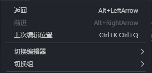

#  VScode的学习和应用
## python
python 的文件后缀名是.py
```py
  print("hello world!")
```
## markdown
 markdown是当前流行的一种用来写文档的语言。
 可以快捷的生成漂亮的排版和格式。
 “#”代表是一级标题
 “##”代表是二级标题
 “-----”代表分割线
 ## mysql
 ## 流程图
 流程图的文件后缀名是.dio
 ## 图片
 粘贴的快捷键是
 ctrl+alt+v
 就可以把复制的图片直接粘贴过来
 配合截图使用，设置图片保存的位置
